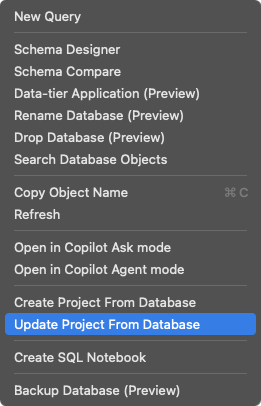

# SQL Notebooks

SQL notebook support for VS Code — a companion extension to the [MSSQL extension](https://marketplace.visualstudio.com/items?itemName=ms-mssql.mssql).

Run SQL queries interactively in Jupyter notebooks (`.ipynb`) using the **SQL** kernel. All SQL execution is handled by the MSSQL extension — no additional drivers or runtimes required.

## Features

- **SQL kernel for Jupyter notebooks** — select "SQL" from the kernel picker in any `.ipynb` file
- **Zero dependencies** — delegates all SQL execution to the MSSQL extension via its public API
- **One connection per notebook** — each notebook maintains its own database connection
- **Database switching** — change databases without manually reconnecting
- **GO batch splitting** — T-SQL `GO` separators are handled automatically
- **HTML result tables** — query results render as formatted HTML tables
- **Object Explorer integration** — right-click a server or database node to create a pre-connected notebook
- **Magic commands** — manage connections directly from notebook cells

## Prerequisites

- [VS Code](https://code.visualstudio.com/) 1.85 or later
- [MSSQL extension](https://marketplace.visualstudio.com/items?itemName=ms-mssql.mssql) (`ms-mssql.mssql`)

## Installation

### From VSIX

1. Download the latest `.vsix` from the [Releases](https://github.com/croblesm/sql-notebooks/releases) page
2. Install via the command line:
   ```bash
   code --install-extension sql-notebooks-0.1.2.vsix
   ```
   Or in VS Code: Command Palette → **Extensions: Install from VSIX...** → select the downloaded file

### From source

```bash
git clone https://github.com/croblesm/sql-notebooks.git
cd sql-notebooks
npm install
npm run build
npx vsce package
# Then install the generated .vsix file as above
```

## Getting Started

### 1. Create a SQL Notebook

**Option A — From Object Explorer:** Right-click a server or database node and select **Create SQL Notebook**.



**Option B — From any `.ipynb` file:** Open or create a `.ipynb` notebook, then select **SQL** from the kernel picker in the top-right corner.

**Option C — From the Command Palette:** Run **SQL Notebooks: Create SQL Notebook**.

### 2. Connect and Run Queries

1. Write a SQL query in a code cell
2. Run the cell — you'll be prompted to connect on first execution
3. Results appear as HTML tables in the cell output

### 3. Switch Databases

You can switch databases on the current server in several ways:

| Method | How |
|--------|-----|
| **Code lens** | Click the `server / database` link above any cell |
| **Status bar** | Click the connection info in the bottom status bar |
| **Magic command** | Run `%%use AdventureWorks` in a cell |
| **Database picker** | Run `%%use` (no argument) to open an interactive picker |
| **Command Palette** | Run **SQL Notebooks: Change Database** |

### 4. Switch Connections

To connect to a different server:

| Method | How |
|--------|-----|
| **Magic command** | Run `%%connect` in a cell |
| **Command Palette** | Run **SQL Notebooks: Change Connection** |

## Commands

| Command | Description |
|---------|-------------|
| `SQL Notebooks: Create SQL Notebook` | Create a new `.ipynb` notebook with the SQL kernel selected |
| `SQL Notebooks: Change Database` | Pick a different database on the current server |
| `SQL Notebooks: Change Connection` | Disconnect and connect to a different server |

## Magic Commands

Type these in a code cell and run:

| Command | Description |
|---------|-------------|
| `%%connect` | Open the connection picker (or switch connections) |
| `%%disconnect` | Close the current connection |
| `%%connection` | Display the active connection info |
| `%%use <database>` | Switch to a specific database on the current server |
| `%%use` | Open an interactive database picker |

## Known Limitations

| Limitation | Details |
|------------|---------|
| **One connection per notebook** | All cells share a single connection. Use `%%connect` to switch servers, `%%use` to switch databases. |
| **No session persistence** | Temp tables, variables, and `SET` options don't carry over between cells. Each cell execution gets its own context. |
| **No IntelliSense** | SQL autocomplete is not yet available in notebook cells. |
| **Static result tables** | Results render as HTML tables without sorting or filtering. |

## How It Works

This extension is a thin UI layer on top of the MSSQL extension's public API:

- **Connections** — `IExtension.promptForConnection()` and `IExtension.connect()` handle all connection management
- **Query execution** — `connectionSharing.executeSimpleQuery()` runs SQL and returns structured results
- **Database switching** — Disconnect + reconnect with a modified connection profile (same pattern as MSSQL copilot tools)
- **Notebook UI** — VS Code's built-in `NotebookController` API and `.ipynb` support — no custom renderer needed

## License

[MIT](LICENSE)
